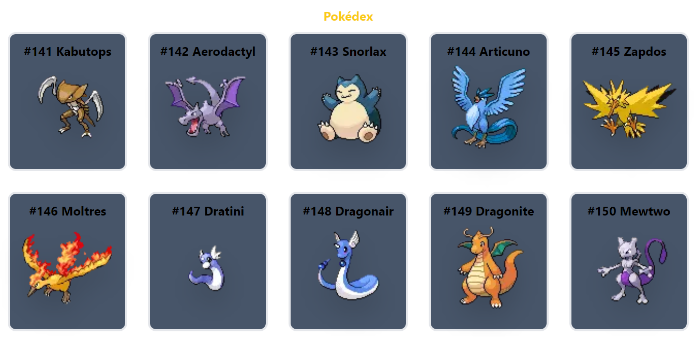
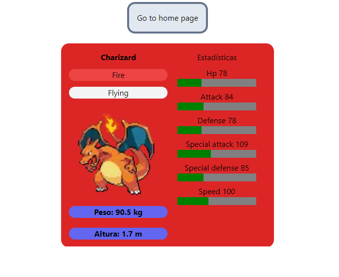

## Pokedex

### Technologies

This project is using the famous [pokeapi](https://pokeapi.co/), the react Framework [Nextjs](https://nextjs.org/).

This is an example

This show 20 pokemon, if you want see more, yo can press de button for show the next or the last pokemon.

If you press the pokemon for see the information this is a result

